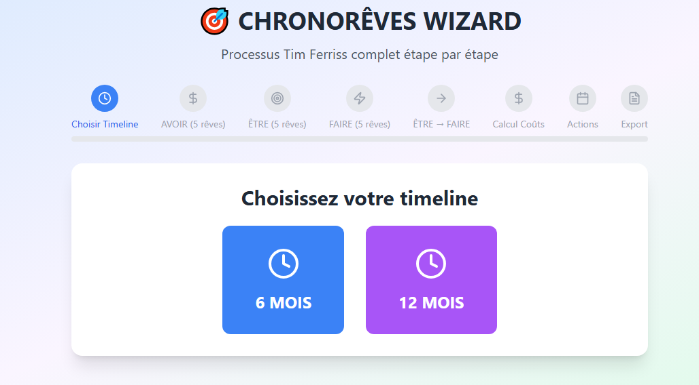

# CHRONORÊVES WIZARD 🎯

Une application web interactive pour guider les utilisateurs à travers le processus de "Dreamlining" (ou Chronorêves), une méthode de définition d'objectifs popularisée par Tim Ferriss dans son livre "La Semaine de 4 Heures".

Cet outil transforme un exercice théorique en une expérience guidée, étape par étape, pour vous aider à définir, chiffrer et planifier vos rêves les plus ambitieux.


*(Astuce : Faites une belle capture d'écran de votre application, téléchargez-la sur votre dépôt GitHub, et remplacez `URL_DE_VOTRE_SCREENSHOT.png` par son lien !)*

## ✨ Le concept du Dreamlining

Le Dreamlining consiste à appliquer des délais concrets à vos rêves pour les rendre réalisables. Plutôt que de vagues désirs, cette méthode vous pousse à définir précisément ce que vous voulez :
- **AVOIR** (biens matériels)
- **ÊTRE** (compétences, qualités)
- **FAIRE** (expériences, voyages)

En calculant le coût réel de ces rêves, l'application détermine votre **Revenu Mensuel Cible (RMC)** et votre **Revenu Quotidien Cible (RQC)**, vous donnant ainsi un objectif financier clair et motivant pour atteindre votre style de vie idéal.

## 🚀 Fonctionnalités

- **Wizard guidé étape par étape** : Un parcours simple en 8 étapes pour ne jamais se perdre.
- **Délais de 6 ou 12 mois** : Choisissez l'horizon de temps qui vous convient le mieux.
- **Catégorisation des rêves** : Séparez clairement vos objectifs en `AVOIR`, `ÊTRE`, et `FAIRE`.
- **Calcul automatique des coûts** : Estimez le coût de chaque rêve et obtenez instantanément votre RMC et RQC.
- **Plan d'action immédiat** : Définissez les trois actions cruciales à entreprendre aujourd'hui, demain et cette semaine.
- **Export en Markdown** : Générez un résumé complet de votre plan, parfait pour le suivi ou pour le donner à une IA pour des conseils stratégiques.

## 🛠️ Technologies utilisées

- **React** (avec les Hooks `useState` et `useEffect`)
- **Vite** comme outil de build ultra-rapide
- **Tailwind CSS** pour un design moderne et responsive
- **Lucide-React** pour des icônes claires et légères

## 🏁 Pour commencer (Faire fonctionner le projet localement)

Suivez ces étapes pour lancer une version de l'application sur votre propre machine.

### Prérequis

Assurez-vous d'avoir [Node.js](https://nodejs.org/) (version 16 ou supérieure) installé.

### Installation

1.  **Clonez ce dépôt sur votre machine :**
    ```bash
    git clone https://github.com/CedrusCoffee/dreamlining-app.git
    ```

2.  **Naviguez dans le dossier du projet :**
    ```bash
    cd dreamlining-app
    ```

3.  **Installez les dépendances nécessaires :**
    ```bash
    npm install
    ```

4.  **Lancez le serveur de développement :**
    ```bash
    npm run dev
    ```

5.  Ouvrez votre navigateur et allez à l'adresse `http://localhost:5173`. L'application devrait être en cours d'exécution !

## 🤝 Contribution

Les contributions sont les bienvenues ! Si vous avez des idées pour améliorer cet outil, n'hésitez pas à forker le dépôt et à créer une Pull Request.

1.  Forkez le projet
2.  Créez votre branche de fonctionnalité (`git checkout -b feature/AmazingFeature`)
3.  Commitez vos changements (`git commit -m 'Add some AmazingFeature'`)
4.  Poussez vers la branche (`git push origin feature/AmazingFeature`)
5.  Ouvrez une Pull Request

## 📜 Licence

Ce projet est distribué sous la licence MIT. Voir le fichier `LICENSE` pour plus d'informations.

---
*Inspiré par la méthode de Tim Ferriss.*
